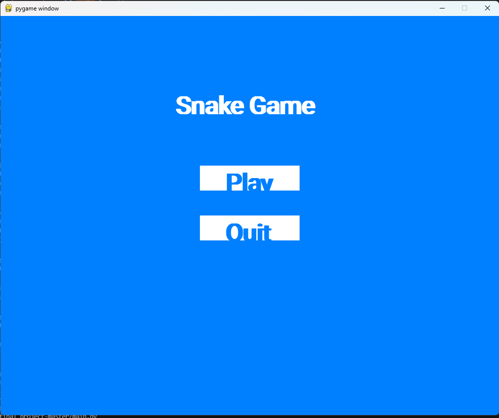
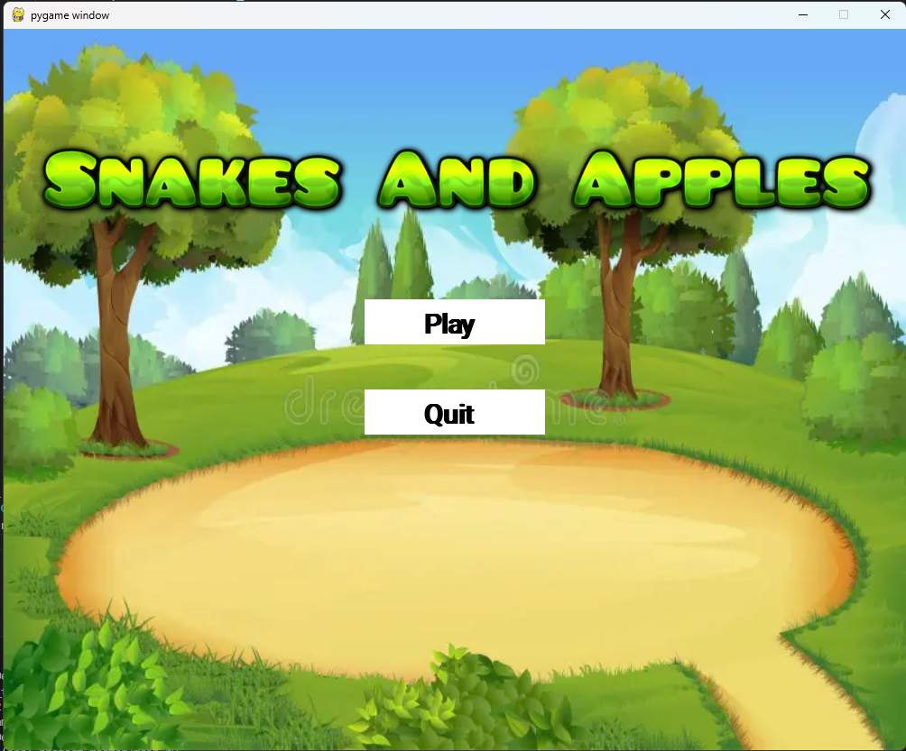

:warning: Everything between << >> needs to be replaced (remove << >> after replacing)

# Snakes and Apples 
## CS110 B1 Final Project  Fall Semester, Freshman

## Team Members

Hanssen Ly

***

## Project Description

This game will involve playing as a snake and eating apples. For every apple you eat, your score and body length will increase by one. If you run into your own body, you die and you have to start over. Your goal is to stay alive as long as you can and eat all the apples you can.

***    

## GUI Design

### Initial Design

### Final Design

## Program Design

### Features

1. << Feature 1 >>
2. << Feature 2 >>
3. << Feature 3 >>
4. << Feature 4 >>
5. << Feature 5 >>

### Classes

- << You should have a list of each of your classes with a description >>

## ATP

1: Using the WASD keys to control the direction of the snake.  

| Step                 |Procedure             |Expected Results                   |
|----------------------|:--------------------:|----------------------------------:|
|  1                   | Start game.          | The program should start.         |
|                      |                      |                                   |
|  2                   | Press the A key on   | The snake should change directions|
|                      | the keyboard.        | from its current direction to     |
|                      |                      | left.                             |
|                      |                      |                                   |
|  3                   | Press the S key on   | The snake should change directions|
|                      | the keyboard.        | from its current direction to     |
|                      |                      | down.                             |
|                      |                      |                                   |
|  4                   | Press the D key on   | The snake should change directions|
|                      | the keyboard.        | from its current direction to     |
|                      |                      | right.                            |
|                      |                      |                                   |
|  5                   | Press the W key on   | The snake should change directions|
|                      | the keyboard.        | from its current direction to     |
|                      |                      | up.                               |

2: Making sure collisions between the snake and apples are detected properly.

| Step                 |Procedure             |Expected Results                   |
|----------------------|:--------------------:|----------------------------------:|
|  1                   | Start game.          | The program should start.         |
|                      |                      |                                   |
|  2                   | Guide the snake      | The score should stay the same,   |
|                      | around the apples.   | and the apple should stay in the  |
|                      |                      | same location.                    |
|                      |                      |                                   |
|  3                   | Guide the snake to   | The apple should disappear and    |
|                      | an apple.            | reappear in a new location. The   |
|                      |                      | score and the snake's length      |
|                      |                      | should both increase by 1.        |

3: Confirm the game ends when the snake runs into itself.

| Step                 |Procedure             |Expected Results                   |
|----------------------|:--------------------:|----------------------------------:|
|  1                   | Start game.          | The program should start.         |
|                      |                      |                                   |
|  2                   | Play until the       | The snake should be long enough   |
|                      | snake's length is    | to be able to run into itself.    |
|                      | greater than or equal|                                   |
|                      | to 5.                |                                   |
|                      |                      |                                   |
|  3                   | Guide the snake to   | The game should end and the game  |
|                      | its own body segment.| over screen should appear.        |
|                      |                      |                                   |
